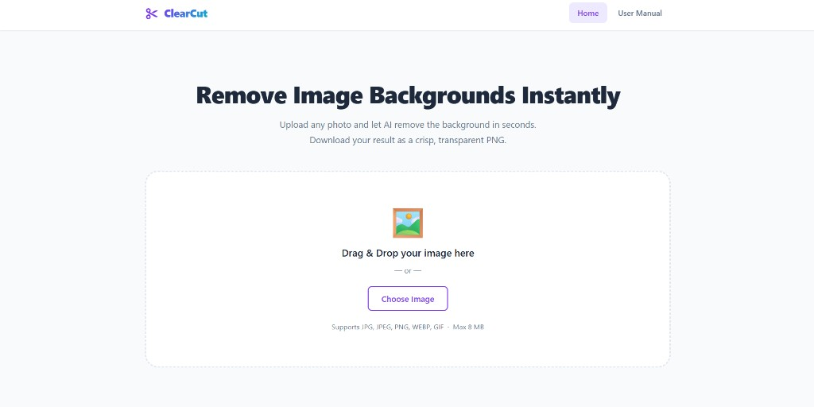
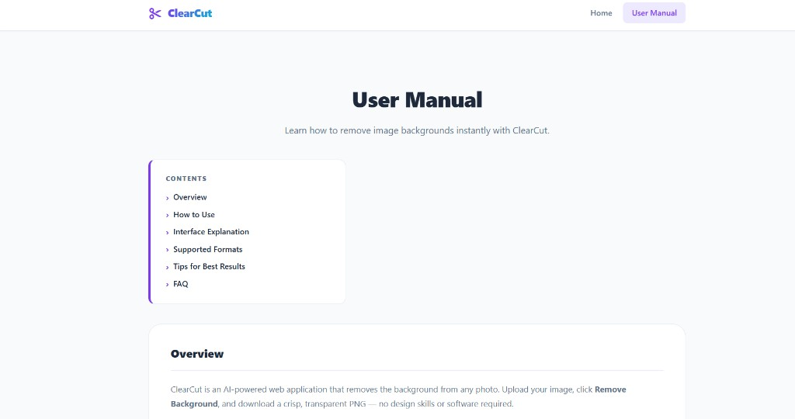

# ClearCut

**ClearCut** is an AI-powered image background removal web application built with PHP, HTML, CSS, and Vanilla JavaScript. Upload any photo, remove its background instantly using the [Pixelcut API](https://developer.pixelcut.ai/), and download a crisp, transparent PNG.

This project is designed to be **student-friendly** — no frameworks, no database, no package managers required. Just PHP, plain HTML/CSS/JS, and a free Pixelcut API key.

---

## Features

- Drag-and-drop or click-to-browse image upload
- Client-side and server-side file validation
- Real-time processing status with stage indicators
- Side-by-side comparison: original vs. background-removed
- Checkerboard transparency preview
- Secure transparent PNG download (`no-bg.png`)
- Automatic cleanup of temporary files
- Responsive design — works on desktop, tablet, and mobile
- No database required
- No framework dependencies

---

## Screenshots

**Home — Upload & Result**



**User Manual**



---

## Technology Stack

| Layer     | Technology                         |
|-----------|------------------------------------|
| Frontend  | HTML5, CSS3, Vanilla JavaScript    |
| Backend   | PHP 8+, PHP cURL                   |
| AI Engine | Pixelcut Background Removal API    |
| Database  | None                               |

---

## Project Structure

```
clearcut/
│
├── index.php           — Main application page (upload, preview, result)
├── manual.php          — User Manual page
├── config.php          — Centralised configuration (API key, paths, limits) ⚠️ in .gitignore
├── README.md           — This file
├── LICENSE             — MIT License
├── .gitignore          — Excludes config.php, uploads/, outputs/, IDE files
├── .htaccess           — Root security rules
│
├── api/
│   ├── process.php     — Receives uploaded image, calls Pixelcut API, returns JSON
│   └── download.php    — Securely serves the result PNG for download / inline preview
│
├── assets/
│   ├── css/
│   │   ├── style.css   — Main application styles
│   │   └── manual.css  — User Manual page styles
│   └── js/
│       ├── app.js      — Main JavaScript (upload, AJAX, result display)
│       └── manual.js   — Manual page JavaScript (smooth scroll)
│
├── docs/
│   └── screenshots/    — README screenshots
│       ├── home.png
│       └── manual.png
│
├── includes/
│   └── footer.php      — Shared page footer
│
├── uploads/            — Temporary uploaded images (auto-deleted after processing) ⚠️ in .gitignore
│   └── .htaccess       — Prevents script execution in this directory
│
└── outputs/            — Processed result PNGs (auto-deleted after 1 hour) ⚠️ in .gitignore
    └── .htaccess       — Blocks all direct HTTP access; files served via api/download.php
```

---

## Requirements

- **PHP 8.0 or higher**
- **PHP cURL extension** enabled
- **Modern web browser** (Chrome, Firefox, Edge, Safari)
- **Internet connection** (Pixelcut API is a cloud service)
- **Pixelcut API key** (free tier available)
- **PHP-compatible web server** (Apache/XAMPP, Nginx, or PHP built-in server)

---

## Pixelcut API

ClearCut uses the **Pixelcut Background Removal API** to perform AI-powered background removal.

**API Endpoint:**
```
https://api.developer.pixelcut.ai/v1/remove-background
```

**Request format:**
```json
{
    "image_url": "https://yourserver.com/uploads/filename.jpg",
    "format": "png"
}
```

**Required headers:**
```
Content-Type: application/json
Accept: application/json
X-API-KEY: your_pixelcut_api_key
```

The API processes the image and returns a `result_url` pointing to the background-removed PNG, which the PHP backend downloads and saves to `outputs/`.

---

## Getting a Pixelcut API Key

1. Visit [https://developer.pixelcut.ai/](https://developer.pixelcut.ai/)
2. Create a free Pixelcut developer account.
3. Navigate to your **API Keys** section in the dashboard.
4. Copy your API key.
5. Paste it into `config.php` (see **Configuration** below).

> **Free tier note:** Pixelcut offers a limited number of free API credits. Check [Pixelcut's pricing page](https://developer.pixelcut.ai/) for current limits.

---

## Configuration

Open `config.php` and replace the placeholder with your real Pixelcut API key:

```php
define('PIXELCUT_API_KEY', getenv('PIXELCUT_API_KEY') ?: 'YOUR_API_KEY_HERE');
```

### Option A — Edit config.php directly (simple, not recommended for production)

Replace `YOUR_API_KEY_HERE` with your key:

```php
define('PIXELCUT_API_KEY', getenv('PIXELCUT_API_KEY') ?: 'sk_your_actual_key');
```

### Option B — Use an environment variable (recommended, keeps the key out of source code)

Add this to the **root `.htaccess`** (Apache/XAMPP):

```apache
SetEnv PIXELCUT_API_KEY your_actual_api_key_here
```

Or set it in your hosting panel / server environment. The application checks for this variable first and falls back to the value in `config.php`.

> ⚠️ **Never commit a real API key to GitHub.** Use Option B or add `config.php` to `.gitignore` before pushing.

---

## Local Installation (XAMPP)

1. **Download or clone** the project:
   ```bash
   git clone https://github.com/yourusername/clearcut.git
   ```

2. **Copy the folder** to your XAMPP `htdocs` directory:
   ```
   C:\xampp\htdocs\clearcut\
   ```

3. **Enable PHP cURL** in XAMPP:
   - Open `C:\xampp\php\php.ini`
   - Find the line `;extension=curl`
   - Remove the leading semicolon: `extension=curl`
   - Restart Apache in the XAMPP Control Panel.

4. **Configure your Pixelcut API key** in `config.php`.

5. **Set folder permissions** — XAMPP on Windows handles this automatically.
   On Linux/macOS, run:
   ```bash
   chmod 755 uploads/ outputs/
   ```

6. **Start Apache** in the XAMPP Control Panel.

7. **Open the application** in your browser:
   ```
   http://localhost/clearcut/
   ```

---

## Local Installation (PHP Built-in Server)

If you are not using XAMPP, you can run the project with PHP's built-in development server:

```bash
cd path/to/clearcut
php -S localhost:8000
```

Then open:
```
http://localhost:8000
```

> **Important:** The Pixelcut API needs to fetch your uploaded image via a publicly accessible URL. The PHP built-in server works locally only if Pixelcut can reach your machine (e.g. via a tunnel like [ngrok](https://ngrok.com/)). For the easiest local setup, use XAMPP.

---

## Shared Hosting Deployment

1. **Upload all project files** to your hosting account via FTP or the hosting file manager.
   Place them inside a folder such as `public_html/clearcut/` or `www/clearcut/`.

2. **Confirm PHP 8+ is available.** Check your hosting control panel (cPanel, Plesk, etc.).

3. **Confirm PHP cURL is enabled.** Most shared hosts enable it by default.
   If not, contact your host's support.

4. **Configure your Pixelcut API key** in `config.php` or set an environment variable
   via your hosting panel.

5. **Set folder permissions** (if required by your host):
   - `uploads/` — `755`
   - `outputs/` — `755`

6. **Test** by visiting `https://yourdomain.com/clearcut/` and uploading an image.

---

## Security

- **The API key is never sent to the browser.** It lives only in `config.php` (server-side).
- **Never put the API key in JavaScript.** The Pixelcut call is made exclusively from `api/process.php`.
- **Never commit a real API key to GitHub.** Use environment variables or add `config.php` to `.gitignore`.
- Uploaded files are given **random, unguessable filenames** — the original filename is never used on the server.
- **Directory listing is disabled** in `uploads/` and `outputs/` via `.htaccess`.
- **PHP/script execution is blocked** inside `uploads/` and `outputs/`.
- The download endpoint validates the result ID and uses `realpath()` to **prevent directory traversal**.
- File MIME types are validated with `finfo_file()` — never with the client-supplied `Content-Type`.

---

## Usage

1. Open ClearCut in a web browser.
2. Drag an image into the upload area, or click **Choose Image**.
3. Check the preview, then click **Remove Background**.
4. Wait for Pixelcut to process the image (typically 3–15 seconds).
5. Compare the original and result side by side.
6. Click **Download PNG** to save `no-bg.png`.
7. Click **Upload Another** to process a new image.

---

## Limitations

- Pixelcut requires an **active internet connection** — background removal cannot work offline.
- API usage **consumes Pixelcut credits** according to your Pixelcut plan. Monitor your usage in the Pixelcut dashboard.
- Processing time depends on **API and network availability**. Expect 3–20 seconds.
- The API key **must be configured** before background removal can function.
- Very large images (close to 8 MB) may take longer to upload and process.
- Free Pixelcut accounts have a limited number of credits per month.

---

## Troubleshooting

### Background removal does not work

- Check that `PIXELCUT_API_KEY` in `config.php` is set to your real Pixelcut API key.
- Confirm your PHP server has a working internet connection.
- Confirm PHP cURL is enabled: `php -m | grep curl`.
- Check that your server's public URL is accessible from the internet (Pixelcut must be able to fetch the uploaded image).
- Check `error_log` in PHP for `[ClearCut]` log entries from `api/process.php`.
- Verify your Pixelcut account has remaining API credits.

### Upload fails

- Confirm PHP's `upload_max_filesize` and `post_max_size` are at least `8M` in `php.ini`.
- Check that the `uploads/` folder exists and is writable by the web server.
- Verify the image is in a supported format: JPG, JPEG, PNG, WEBP, or GIF.
- Make sure the file is not larger than 8 MB.

### Download fails / "file not found"

- Result files are automatically deleted after 1 hour. Download your result promptly.
- Check that the `outputs/` folder exists and is writable.
- Verify `api/download.php` is accessible (not blocked by server configuration).
- Confirm the result ID in the URL matches a file in `outputs/`.

### Images are not previewed in the result section

- Result images are served through `api/download.php?id=<id>&display=1` — not directly from `outputs/`.
- Check browser developer tools (F12) → Network tab for 403/404 errors on the `api/download.php` request.
- Confirm the `outputs/` folder exists and is writable by the web server.

---

## License

This project is licensed under the **MIT License** — see the [LICENSE](LICENSE) file for the full text.

MIT License

Copyright (c) 2026 ClearCut

Permission is hereby granted, free of charge, to any person obtaining a copy
of this software and associated documentation files (the "Software"), to deal
in the Software without restriction, including without limitation the rights
to use, copy, modify, merge, publish, distribute, sublicense, and/or sell
copies of the Software, and to permit persons to whom the Software is
furnished to do so, subject to the following conditions:

The above copyright notice and this permission notice shall be included in all
copies or substantial portions of the Software.

THE SOFTWARE IS PROVIDED "AS IS", WITHOUT WARRANTY OF ANY KIND, EXPRESS OR
IMPLIED, INCLUDING BUT NOT LIMITED TO THE WARRANTIES OF MERCHANTABILITY,
FITNESS FOR A PARTICULAR PURPOSE AND NONINFRINGEMENT. IN NO EVENT SHALL THE
AUTHORS OR COPYRIGHT HOLDERS BE LIABLE FOR ANY CLAIM, DAMAGES OR OTHER
LIABILITY, WHETHER IN AN ACTION OF CONTRACT, TORT OR OTHERWISE, ARISING FROM,
OUT OF OR IN CONNECTION WITH THE SOFTWARE OR THE USE OR OTHER DEALINGS IN THE
SOFTWARE.
# ClearCut_System

# ClearCut_System

